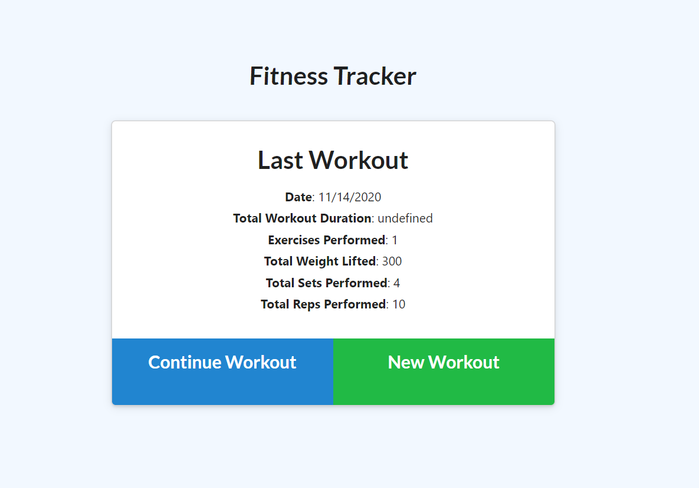
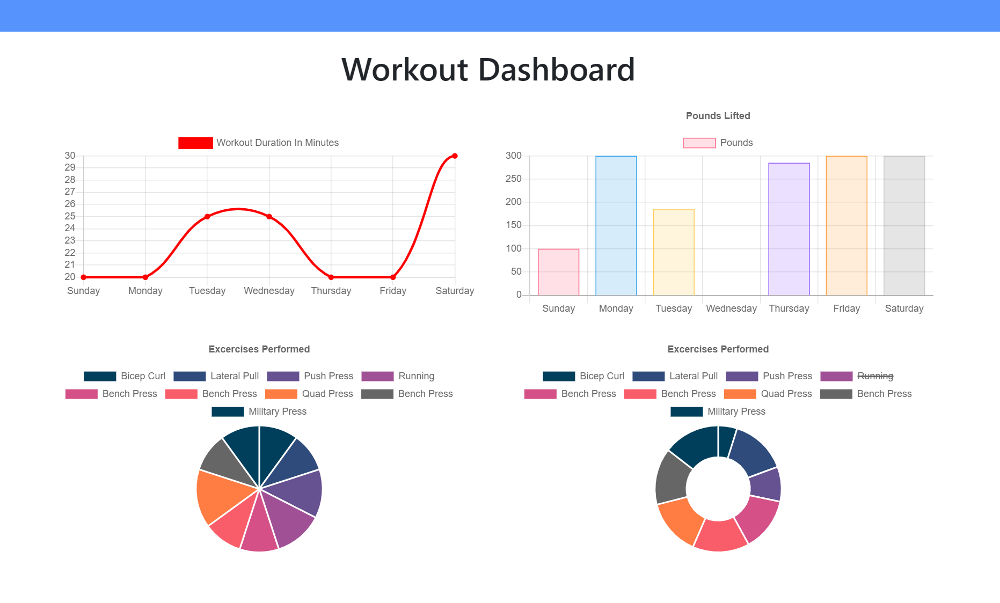

# workout-tracker17

## Description 

This application uses MongoDB and Mongoose to store workout information. When the user loads the page, they can create a new workout, or continue a previous workout. In addition, the user can view all of the stats of their previous workout data. 

Mongoose and MongoDB are alternatives to using MySQL as a database. The syntax for using these databases is slightly different, but I found the MongoDB is easier to use because the syntax is very similar to JavaScript. This application is deployed with MongoDB database to Heroku. 

## Table of Contents 

* [Installation](#installation)
* [Usage](#usage)
* [Credits](#credits)
* [License](#license)
* [Questions](#questions)
* [Heroku](#heroku)

## Installation

Steps to install my project include:
* npm install the dependencies 

## Usage 

* When the user first logs in they can see their last workout, and either continue a workout or create a new workout. 

* When the user clicks on dashboard in the nav bar they are directed to stats of their workouts.

## Credits

All of the code was developed by Dana Kuglin. Information about her GitHub profile and how you can contact her are listed below in the questions section.  

## License

This project is licensed under MIT.

## Questions

GitHub Username: dakuglin
GitHub Profile: (https://github.com/dakuglin)

Please email me with additional questions at dakuglin@gmail.com  

## Heroku

The link the the deployed application on Heroku can be found at ()
